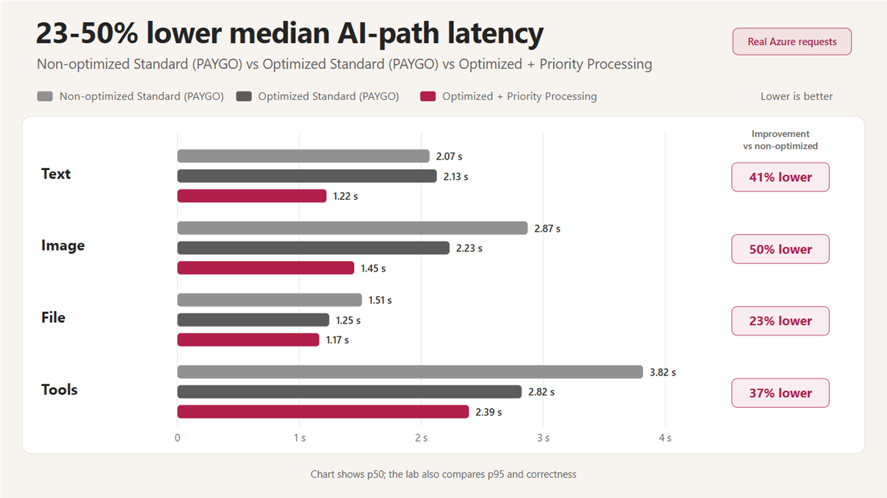

# How to make AI responses faster on Microsoft Foundry: evidence from 2,040 measured task attempts



A faster model does not always produce a faster AI application.

Latency can come from generating text the application does not use, processing visual detail the task does not need, sending the same prompt content repeatedly, discovering tools, opening MCP sessions, waiting for independent requests in sequence, or adding another model round to a tool workflow.

To separate those effects, we built a reproducible performance lab on Microsoft Foundry. The analyzed evidence set contains 2,040 measured task attempts across text, image, file, function-tool, MCP, and Microsoft Foundry Toolbox workloads. The publication-run audit trail contains 2,160 measured executions, excluding cloud preflights and including 120 earlier client-lifecycle runs discarded after correcting the timing boundary.

The main result was not one universal optimization. It was an order of operations:

1. remove unnecessary work;
2. reuse work and connections;
3. remove serial waits and avoidable model requests;
4. then test Priority Processing for the provider time that remains.

In our final confirmation, combining supported software changes with verified Priority Processing reduced median AI-path latency by **23% to 50%**, depending on the workload, compared with a non-optimized Standard pay-as-you-go configuration.

That is a comparison of complete configurations. It is **not** the isolated effect of Priority Processing.

> **Want the short version?**
>
> - Generate only the output the application needs.
> - Put stable prompt content first and verify cache hits.
> - Use the least expensive multimodal representation that preserves required evidence.
> - Remove serial waits and unnecessary model rounds.
> - Limit the active tool surface and reuse app-managed MCP sessions.
> - Apply Priority Processing only after software optimization, and verify the returned service tier.
>
> Measure correctness and reliability with latency. A fast wrong answer is not a performance improvement.

[Jump to the decision guide](#a-practical-decision-guide).

## What we measured

We used five deterministic fixtures per scenario, three unmeasured warm-ups, and 30 randomized rounds per case. Treatment and control ran against the same rotating fixtures in a seeded, interleaved schedule. Comparisons were paired by round when treatment and control were part of the same execution.

The full evidence set contains:

- 1,680 analyzed measurements from the one-lever screen, including the corrected client-lifecycle comparison;
- 120 earlier client-lifecycle timing runs discarded from analysis;
- 360 measurements from the final three-configuration confirmation;
- 2,040 analyzed measurements;
- 2,160 measured publication executions, excluding cloud preflights, after including 120 discarded timing runs.

We retained failed and incorrect attempts in reliability counts. Latency percentiles include only successful, correctness-passing attempts.

The reported **AI-path latency** starts immediately before a model request or composed model-and-tool loop and stops after the result has been validated. It excludes:

- user-to-application networking;
- UI rendering;
- image resizing and encoding;
- PDF generation;
- text extraction or OCR performed before the request.

This is therefore not click-to-render latency. When preprocessing was outside the timer, we use narrow claims such as "with text already extracted, the AI path was faster."

The one-lever screen used `gpt-4.1-mini`. The final Priority Processing confirmation used `gpt-4.1`, version `2025-04-14`, on one Global Standard deployment in East US 2. We did not benchmark Provisioned Throughput, Foundry Agent Service invocations, RAG, or voice-agent latency in the main comparison.

The [lab report](https://github.com/yelghali/foundy-ai-perf-testing/blob/main/docs/lab-report.md) documents the complete protocol, architecture, results, and limitations. The [result ledger](https://github.com/yelghali/foundy-ai-perf-testing/blob/main/docs/publication-results.md) contains the execution IDs, artifact versions, confidence intervals, and reliability events.

## Results at a glance

The table below summarizes the most decision-relevant one-lever results.

| Change tested | Workload | Observed median result | Important qualification |
|---|---|---:|---|
| Generate a concise text answer | Text | **26.0% faster** | 29/30 correct; one stream ended before completion |
| Generate concise JSON | Image | **24.9% faster** | 30/30 correct |
| Reuse a cacheable prompt prefix | Text / image | **14.9% / 23.6% faster** | Requests had to report cached tokens |
| Use low image detail | Image | **17.8% faster** | Fine text and visual evidence must remain accurate |
| Send already-extracted text instead of a PDF | File | **17.2% faster AI path** | Extraction or OCR time was outside the timer |
| Process three independent pages concurrently | File | **56.8% faster** | Same three model requests; only scheduling changed |
| Request two required functions in one model response | Function tools | **28.2% faster** | Mainly one fewer model request, not just parallel handlers |
| Expose five tools instead of 20 | Function tools | **16.8% faster** | The required tool must remain available |
| Use minimal tool descriptions | Function tools | **14.4% faster** | Selection and arguments must stay correct |
| Reuse an app-managed MCP session | MCP | Avoided a **34.1% cold penalty** | Requires safe lifecycle and recovery handling |
| Add tool search to a 50-tool Toolbox | Toolbox / MCP | **43.0% slower p50** | Input tokens fell 26%; correctness and p95 improved |

These are workload-specific findings, not service guarantees. A result was labelled faster only when the paired 95% interval for the median effect excluded zero. The intervals were not adjusted for testing many hypotheses, so the findings remain exploratory until independently replicated. With 30 observations per arm, p95 is descriptive rather than a release-grade tail estimate.

## 1. Remove work the task does not need

### Generate only the required output

The simplest supported optimization was shortening the output contract.

For text, a compact answer reduced median latency from **2,078 ms to 1,537 ms**, a **26.0%** improvement among correct completions.

For image extraction, concise JSON reduced the median from **1,646 ms to 1,237 ms**, a **24.9%** improvement with 30/30 correct completions.

This does not mean every answer should be terse. It means the model should not generate content that the next application step discards.

A UI card may require five fields. A routing step may require one enum. A tool planner may need only validated arguments. Define that contract explicitly, then verify that the shorter response still satisfies the product requirement.

Reducing input is different. Removing 12 irrelevant history turns lowered the observed text median by 12.7%, but the paired interval crossed zero. That result was inconclusive for this small test. Removing irrelevant context can still reduce input-token cost, but this lab does not claim a proven latency improvement for that treatment.

### Use only the visual representation the task requires

Low image detail was **17.8% faster** than high detail for extracting invoice ID, total, and status.

Low detail asks the service to analyze a lower-resolution representation. It can work well for large, clearly printed fields, but it can miss small text, handwriting, charts, or spatial evidence. Start low only when deterministic validation confirms that every required field remains accurate.

Image resizing also lowered the median by 12.8%, but descriptive p95 increased from **5.1 seconds to 8.8 seconds**. That does not invalidate the median result, but it does mean the occasional slow attempts need more investigation. Local resize time was also outside the AI-path timer.

For files, sending already-extracted text was **17.2% faster** than native PDF input. The claim is intentionally narrow: extraction or OCR happened before the timer.

Use text when the task depends only on textual facts. Keep native document processing when layout, signatures, charts, handwriting, or other visual evidence matters. A full-pipeline decision must include extraction cost and reliability.

## 2. Reuse work and connections

### Put repeated prompt content first

Prompt caching reuses work on a matching prefix. It does not cache the answer, and it does not independently cache arbitrary fields.

For the `gpt-4.1` models in this lab, an eligible request required at least 1,024 input tokens. The first 1,024 tokens had to match a recent request.

The practical request shape is:

```text
[STABLE] system instructions
[STABLE] examples and output rules
[STABLE] shared reference content
[CHANGES] current question, image, document, or request-specific data
```

If a timestamp or request ID appears at the beginning, requests differ immediately and the stable instructions that follow cannot form one long matching prefix.

Warm-prefix caching reduced text median latency by **14.9%** and image median latency by **23.6%**. Average text time to first token fell from 991 ms to 602 ms.

We verified the mechanism instead of assuming it worked: warm requests reported cached tokens, while controls that changed the beginning reported none.

Caching did not produce a clear median improvement for file or function-tool tasks in this run. Reusing prompt work matters less when document processing, tool selection, or another stage dominates.

See [Prompt caching](https://learn.microsoft.com/azure/foundry/openai/how-to/prompt-caching) for current eligibility and retention details.

### Reuse app-managed MCP sessions

For the MCP comparison, the benchmark application was the client.

A reused session completed in **2,283 ms** at p50. Creating a connection, initializing the session, and discovering tools for every task raised p50 to **3,061 ms** - a **34.1% cold penalty**. Setup and discovery averaged 1,016 ms; the local tool itself remained below 5 ms.

The optimization is therefore an application lifecycle decision:

```python
async with connect_mcp(MCP_URL) as mcp:
    for task in tasks:
        await handle_task(task, mcp)
```

In a service, own the connection for the application lifespan or use a bounded pool when one session cannot safely serve expected concurrency.

Long-lived MCP sessions also require expiry, reconnect, authentication isolation, credential rotation, health checks, and catalogue refresh. Reuse sessions only within the appropriate credential and tenant boundary.

The repository includes the [complete MCP connection helper](https://github.com/yelghali/foundy-ai-perf-testing/blob/main/src/ai_perf/mcp_client.py#L51-L96).

## 3. Remove serial waits and unnecessary model requests

### Run independent page requests concurrently

The largest supported one-lever effect came from processing three independent document pages concurrently.

Both configurations made the same three model requests. The sequential version waited for one response before starting the next. The concurrent version started all three before waiting for their results.

Median latency fell from **2,811 ms to 1,216 ms**, a **56.8%** improvement.

This is a scheduling result. It applies only when requests are independent and model quota can support the burst. Production code still needs bounded concurrency, timeouts, and partial-failure handling.

### Remove an avoidable model round from function workflows

The function-tool task needed both weather and local time.

```text
Slower:
model -> weather -> model -> time -> model -> final answer

Faster:
model -> weather + time -> model -> final answer
```

The faster design allowed one model response to request both functions. It reduced the workflow from three model requests to two and lowered p50 from **3,646 ms to 2,617 ms**, a **28.2%** improvement.

The synthetic handlers completed in under 5 ms, so most of the benefit came from removing a model request. Running the handlers concurrently is a separate mechanism.

For app-run functions:

- allow the model to request multiple calls;
- validate tool names and arguments;
- confirm that calls are independent and safe to overlap;
- run asynchronous I/O together;
- return one output for every original call ID;
- ask the model for the final answer after all required results arrive.

`parallel_tool_calls=True` permits multiple calls but does not guarantee that the model selects every required tool. `asyncio.gather` overlaps asynchronous I/O; it does not make blocking synchronous code parallel.

The 28.2% result applies to app-executed function tools. It should not be transferred to service-managed MCP or Foundry Agent Service without a separate benchmark and traces showing actual execution behavior.

## 4. Keep the active tool surface intentional

Tool definitions are part of the model input. Even when the actual function runs in milliseconds, selection and final generation can take seconds.

Reducing the active catalogue from 20 function tools to five lowered p50 by **16.8%**. Using minimal descriptions lowered p50 by **14.4%**.

The useful design pattern is:

1. route the request to a domain;
2. expose only that domain's relevant tools;
3. keep names, descriptions, and schemas concise but discriminative;
4. validate selection and arguments, not token count alone.

Other tool-schema treatments were inconclusive at this sample size. Exposing 50 tools, adding complex schemas, making descriptions ambiguous, and reordering definitions did not produce a supported median effect. Some descriptive p95 values were slower, but 30 attempts are not enough to conclude that those treatments consistently damage tail latency.

### Tool search is a latency, context, and selection trade-off

We compared the same synthetic 50-tool catalogue through:

- direct remote MCP, exposing every definition to the model;
- Microsoft Foundry Toolbox tool search, initially exposing only `tool_search` and `call_tool`.

Tool search reduced average input from **1,941 to 1,431 tokens**, about 26%. It also achieved 100% correctness in this run and had a better descriptive p95.

However, the extra search round increased p50 from **2,528 ms to 3,614 ms**, a **43.0% median penalty**.

This is not a verdict against tool search. It is the trade-off the feature is designed to make: reduce the initial context, discover relevant capabilities dynamically, and potentially improve selection as the catalogue grows.

Use tool search when catalogue size, context pressure, or selection quality is the main problem. If first-turn latency matters most and the application already knows a small relevant subset, direct exposure can be faster.

See [Tool search](https://learn.microsoft.com/azure/foundry/agents/how-to/tools/tool-search) and the [Toolbox overview](https://learn.microsoft.com/azure/foundry/agents/concepts/toolbox-overview).

## Apply Priority Processing after software optimization

Our first Priority Processing-labelled requests taught an important validation lesson: the selected model did not support the requested tier, and every response reported `service_tier=default`.

We kept those observations in the audit trail but excluded them as Priority Processing evidence.

The final confirmation used a supported `gpt-4.1` deployment. Every successful Priority Processing response reported:

```text
service_tier=priority
```

We compared:

1. non-optimized Standard pay-as-you-go;
2. optimized Standard pay-as-you-go;
3. the same optimized setup with Priority Processing.

| Workload | Non-optimized Standard | Optimized Standard | Optimized + Priority Processing | Combined improvement |
|---|---:|---:|---:|---:|
| Text | 2,070 ms | 2,125 ms | 1,222 ms | **41.0% faster** |
| Image | 2,872 ms | 2,234 ms | 1,448 ms | **49.6% faster** |
| File | 1,512 ms | 1,245 ms | 1,165 ms | **23.0% faster** |
| Function tools | 3,817 ms | 2,824 ms | 2,393 ms | **37.3% faster** |

Every value is median AI-path latency. The combined improvement compares optimized software plus Priority Processing with non-optimized Standard.

Software alone clearly improved the image, file, and function-tool workloads. The optimized text arm was inconclusive on `gpt-4.1`.

Adding Priority Processing to the optimized setup lowered observed p50 in all four workloads. The evidence was clearest for text and image. File and function-tool results varied too much to confirm the size of their additional improvement.

Standard completed correctly 240/240 times. Priority Processing completed correctly 119/120 times, with one function-tool failure. For file and function-tool workloads, descriptive p95 was slower under Priority Processing than under optimized Standard in this run. With 30 attempts per arm, that is a reason to gather more tail observations before setting an SLO, not a firm tail-latency conclusion.

Priority Processing is pay-as-you-go at its own rate. Provisioned Throughput reserves dedicated capacity measured in PTUs; it was outside this comparison. Review the current [deployment categories](https://learn.microsoft.com/azure/foundry/openai/concepts/provisioned-throughput#deployment-categories-compared) and [Priority Processing documentation](https://learn.microsoft.com/azure/foundry/openai/concepts/priority-processing) before selecting a processing option.

## What did not produce a clear median improvement

Negative and inconclusive findings are part of the result:

- `gpt-4.1-nano` was not consistently faster than `gpt-4.1-mini`; it was **25.0% slower** for the tested image task;
- removing 12 irrelevant text-history turns was inconclusive for latency;
- recreating the SDK client was inconclusive;
- selecting one PDF page instead of three was inconclusive;
- prompt caching was inconclusive for the tested file and function-tool tasks;
- many-parameter and nested schemas, ambiguous descriptions, and reordered tool definitions were inconclusive.

These findings do not prove that the changes never help. They show that model names, token counts, and architectural intuition are not performance evidence. Test the real task, score correctness, retain failures, and identify which stage actually dominates.

## A practical decision guide

| Likely source of delay | What to test | What must remain true |
|---|---|---|
| Long generated responses | Request only the required output | The answer remains complete and correct |
| Repeated long prompt content | Move stable content first and keep it identical | Responses report cached tokens |
| Image processing | Try low detail | Fine text and required visual evidence remain accurate |
| Document representation | Compare native PDF with extracted text | Extraction time is included and visual evidence is preserved when needed |
| Independent page requests | Run them concurrently | Requests are independent and quota supports the burst |
| Extra model rounds between tools | Request required functions in one model response | The same functions and arguments are selected |
| Slow independent app-run functions | Overlap asynchronous I/O | Side effects, quotas, timeouts, and failures are safe |
| Large static tool surface | Route to a smaller relevant catalogue | The correct tool remains available |
| Large dynamic catalogue | Test Toolbox tool search | Token and selection benefits justify the search round |
| Repeated MCP setup | Reuse the app-managed session | Authentication, expiry, reconnect, and isolation remain safe |
| Provider processing time | Test Priority Processing | Returned tier, p50, p95, reliability, quality, cost, and residency meet the goal |

Use the following sequence for each experiment:

1. define what a correct answer must contain;
2. name the timer's exact start and stop;
3. pair control and treatment on representative fixtures;
4. randomize which one runs first;
5. retain failures in the reliability result;
6. calculate latency only from correct completions;
7. test compatible winners together instead of adding isolated percentages.

## Reproduce the lab

The [foundy-ai-perf-testing repository](https://github.com/yelghali/foundy-ai-perf-testing) contains the benchmark implementation, Terraform environment, deterministic fixtures, raw-result processing, and reports.

After configuring the documented Azure environment variables, run a smoke test before starting paid benchmark rounds:

```powershell
ai-perf run-suite `
  --profile smoke `
  --warmups 1 `
  --repetitions 2
```

Run the one-lever screen:

```powershell
ai-perf run-suite `
  --profile screen `
  --warmups 3 `
  --repetitions 30 `
  --schedule interleaved `
  --seed 20260904
```

Then run the combined confirmation:

```powershell
ai-perf run-suite `
  --profile bundle `
  --warmups 3 `
  --repetitions 30 `
  --schedule interleaved `
  --seed 20260904
```

Use synthetic or approved data, confirm quota and expected cost before running, and replace the included fixtures with examples that represent the production workload.

The repository also includes:

- an [AI response performance testing guide](https://github.com/yelghali/foundy-ai-perf-testing/blob/main/docs/ai-response-performance-guidelines.md);
- the full [lab report](https://github.com/yelghali/foundy-ai-perf-testing/blob/main/docs/lab-report.md);
- the auditable [publication result ledger](https://github.com/yelghali/foundy-ai-perf-testing/blob/main/docs/publication-results.md);
- an [AI response performance Copilot skill](https://github.com/yelghali/foundy-ai-perf-testing/blob/main/.github/skills/ai-response-performance/SKILL.md) for applying the method to another repository.

The most useful next comparison is not another universal optimization rule. It is the same controlled experiment on a different model, region, and production-shaped workload: which change moved p50, which changed p95, and which looked faster until correctness was included?
